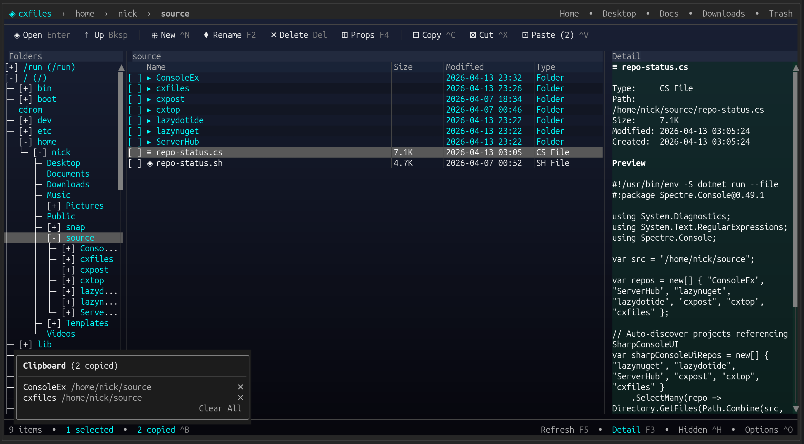

# CXFiles

<div align="center">

[](LICENSE)
[](https://dotnet.microsoft.com/)
[]()

</div>

**A cross-platform terminal file explorer built on [SharpConsoleUI](https://github.com/nickprotop/ConsoleEx).**

<div align="center">

### If you find CXFiles useful, please consider giving it a star!

It helps others discover the project and motivates continued development.

[](https://github.com/nickprotop/cxfiles/stargazers)

</div>

CXFiles brings a polished, Windows Explorer-style file manager to the terminal. Three-pane layout with folder tree, file list, and detail panel. Full file operations with background progress tracking, trash support, context menus, and keyboard-driven navigation.

**Browse. Copy. Manage.**



## Quick Start

**Option 1: One-line install** (Linux/macOS, no .NET required)
```bash
curl -fsSL https://raw.githubusercontent.com/nickprotop/cxfiles/master/install.sh | bash
cxfiles
```

**Windows** (PowerShell)
```powershell
irm https://raw.githubusercontent.com/nickprotop/cxfiles/master/install.ps1 | iex
```

**Option 2: Build from source** (requires .NET 10)
```bash
git clone https://github.com/nickprotop/cxfiles.git
cd cxfiles
./build-and-install.sh
cxfiles
```

## Features

| | |
|---|---|
| 🗂️ **Three-Pane Layout** | Folder tree, sortable file list with checkboxes, toggleable detail panel |
| 📋 **File Operations** | Copy, cut, paste, delete, rename with background progress tracking |
| 🗑️ **Trash Support** | Cross-platform trash (XDG on Linux, ~/.Trash on macOS, Recycle Bin on Windows) with restore and empty |
| 📎 **Clipboard Portal** | View, manage, and remove individual clipboard items (Ctrl+B) |
| 🌳 **Folder Tree** | Lazy-loading tree with single-click navigation and two-way sync |
| 🔍 **Filter & Sort** | Fuzzy filtering (`/`), click-to-sort columns, column resize |
| 📊 **Operations Portal** | Live progress bars, per-file status, cancel buttons, dismiss completed (Ctrl+P) |
| 🖱️ **Context Menus** | Right-click on files or folders for contextual actions |
| 📁 **Breadcrumb Bar** | Clickable path segments with quick-access locations (Home, Desktop, Docs, Downloads, Trash) |
| 👁️ **Detail Panel** | File properties, permissions, text preview (toggle with F3) |
| ✅ **Multi-Select** | Checkbox selection with bulk copy, cut, delete |
| 🔐 **Sudo Elevation** | Password dialog for privileged operations on Linux/macOS |
| ⚙️ **Options Dialog** | NavigationView-based settings with per-OS config storage |
| 👻 **Hidden Files** | Toggle visibility with Ctrl+H |
| 📡 **File Watcher** | Auto-refresh on external filesystem changes |
| 🎨 **Polished UI** | Gradient background, alternating row tints, truncation fade, column separators, panel headers |

## Keyboard Shortcuts

| Key | Action |
|-----|--------|
| Enter | Open file/folder |
| Backspace | Navigate to parent |
| Delete | Delete selected (trash or permanent) |
| F2 | Rename |
| F3 | Toggle detail panel |
| F4 | Properties |
| F5 | Refresh |
| Ctrl+N | New file |
| Ctrl+Shift+N | New folder |
| Ctrl+C | Copy |
| Ctrl+X | Cut |
| Ctrl+V | Paste |
| Ctrl+B | Clipboard portal |
| Ctrl+P | Operations portal |
| Ctrl+H | Toggle hidden files |
| Ctrl+O | Options |
| / | Filter file list |
| Ctrl+Q | Quit |

## Architecture

CXFiles uses Microsoft.Extensions.DependencyInjection with a clean service layer:

- **IFileSystemService** — File system abstraction (listing, copy, move, delete, watch)
- **ITrashService** — Cross-platform trash with XDG (Linux/macOS) and Windows Recycle Bin implementations
- **SudoService** — Privilege elevation via sudo on Linux/macOS
- **IConfigService** — Per-OS configuration (XDG on Linux, AppData on Windows, Library on macOS)
- **OperationManager** — Background operation tracking with throttled progress events
- **UI Components** — Modular panels (BreadcrumbBar, FileListPanel, FolderTreePanel, DetailPanel, StatusLine)
- **Modals** — Async `TaskCompletionSource`-based dialogs (DeleteConfirm, Rename, NewItem, Properties, Options, Sudo)
- **Portals** — Operations portal, clipboard portal, context menus (portal-based overlays)

## Requirements

- .NET 10 SDK (for building from source)
- A terminal with Unicode support (Kitty, WezTerm, Ghostty, Windows Terminal, iTerm2)

## License

[MIT](LICENSE)
